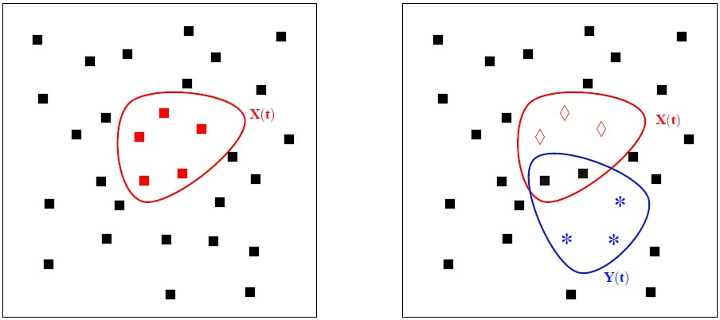
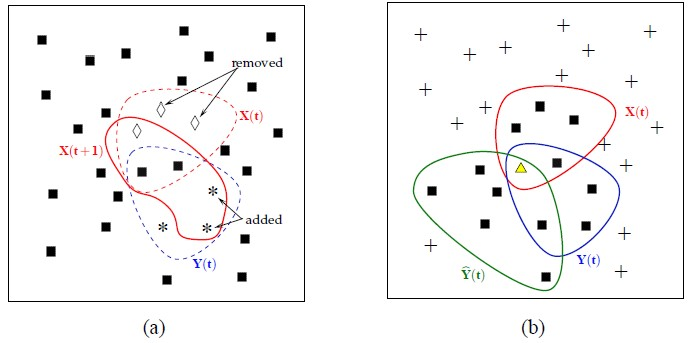
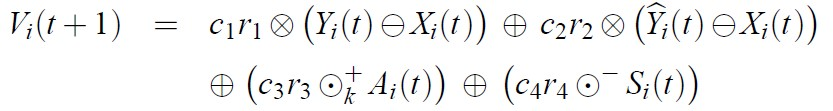

1. [¿Qué es SBPSO?](#optimización-con-pso-basado-en-conjuntos-sbpso)
   - [Explicación simple del algoritmo](#explicación-simple-del-algoritmo)
   - [Definición de los operadores](#definición-de-los-operadores)
2. [¿Cómo funciona la librería SBPSO?](#funcionamiento-de-la-librería-sbpso)
   - [Explicación general](#explicación-general)
   - [Explicación de las funciones en detalle](#explicación-de-las-funciones-en-detalle)

3. [Problema de la mochila con SBPSO](#problema-de-la-mochila-con-sbpso)
   - [¿Cómo se ha implementado?](#cómo-se-ha-implementado)
   - [¿Cómo se usa (interfaz gráfica)?](#uso-de-la-interfaz-gráfica)
4. [Bibliografía](#bibliografía)

# Optimización con PSO basado en conjuntos SBPSO

La implementación del algoritmo SBPSO que se verá a continuación esta basada en el trabajo de fin de Máster de Joost Langeveld, por lo que en esta descripción de nuestra implementación vamos a hacer numerosas referencias a este trabajo aunque hemos hecho ciertos cambios.

##### Vamos a describir a continuación los conceptos del SBPSO:

1.  En primer lugar tenemos que definir un espacio de búsqueda al igual que en PSO, solo que en este caso nuestro espacio de búsqueda en vez de ser un espacio continuo vamos a tener un espacio discreto y por lo tanto con un número finito de elementos. Lo vamos a representar con U, donde U es un conjunto de elementos.
2. Vamos a necesitar una variable posición de las partículas, a diferencia de PSO donde la posición es una coordenada, en SBPSO estará formada por un conjunto de elementos del espacio de búsqueda (U).    La vamos a representar con Xi, donde Xi es un conjunto de ciertos elementos.
3. Vamos a tener al igual que en PSO una velocidad de las partículas, en PSO la velocidad es una magnitud que se representa numéricamente, mientras que en SBPSO tendremos un conjunto de expresiones que nos indicaran si tenemos que añadir o eliminar elementos de una posición dada.           La vamos a representar con Vi, donde Vi es una lista de sub-listas que contendrán elementos que tenemos que modificar.
4. Necesitaremos una función objetivo que habrá que optimizar. La vamos a representar con f.
5. Cada una de las partículas va a tener una variable local donde guarde su mejor valor personal encontrado hasta el momento. La vamos a representar con Yi, donde Yi es un conjunto de elementos.
6. Hay también una variable global en la que se guardará el mejor valor encontrado por las partículas. La vamos a representar como ^Yi, donde ^Yi es un conjunto de elementos

## Explicación simple del algoritmo

Para explicar el funcionamiento del algoritmo vamos a suponer que solo tenemos una sola partícula buscando, para que sea mas fácil de ver el funcionamiento global.

La posición de la partícula estará formada por ciertos elementos Xi={e1,e2...,en} de nuestro espacio de búsqueda U, esta posición tendrá cierto valor que se calculara en cada iteración mediante la función objetivo y de esta manera sabremos si la posición en la que esta es buena o mala. En las distintas iteraciones la posición de la partícula deberá cambiar y esto es posible gracias a la velocidad. La velocidad es con conjunto de ciertas expresiones que nos indicaran como cambiar la posición de la partícula, es decir, nos indicará que elementos tenemos que añadir y cuales eliminar de forma que en cada iteración la posición de la partícula vaya variando y por supuesto para cada una de estas diferentes posiciones se calculara su valor.

Como vemos en la imagen a) tenemos representada una partícula conteniendo 5 elementos del espacio de búsqueda. Es muy importante tener en cuenta que los elementos del espacio no tienen orden, es decir, que para los elementos de la partícula no podemos decir que uno esté mas cerca del otro ya que es un conjunto y todos los elementos están igual de cerca unos de otros. En la imagen b) tenemos representado el mejor personal de la partícula, donde los rombos indican que esos elementos están dentro de su posición y los asteriscos indican que están fuera.

Si encontramos un valor mejor que el mejor personal habrá que sustituirlo por el valor encontrado, y por otro lado si encontramos uno mejor que el mejor global se cambiará también.

Para ponernos mas en contexto podemos ver en la figura a) una posición en el tiempo t y la misma posición en el siguiente instante de tiempo. Como podemos observar la velocidad ha indicado que había que eliminar los elementos representados con un rombo y añadir los que están representados por asteriscos. Y en la figura b) podemos ver la posición actual junto a la mejor local y global.

## Definición de los operadores

- La unión/adición de dos velocidades, vamos a tomar 2 velocidades, donde cada velocidad es un conjunto, y los vamos a unir. Lo vamos a representar mediante el símbolo ⊕.
- La diferencia entre 2 posiciones (X1 y X2), tomamos 2 posiciones y vamos a devolver una velocidad. Para ello vamos a considerar los elementos que están en X1 y no en X2 como elementos a añadir y los elementos que están en X2 y no en X1 como elementos a eliminar, y con estos formamos la velocidad que devolveremos. Lo vamos a representar mediante ⊖.
- La multiplicación de una velocidad por un escalar, tomamos un escalar (eta) cuyo valor esta comprendido entre [0,1]  y una velocidad (V), vamos a devolver una sub-lista al azar de V donde eta será un porcentaje de elementos a seleccionar de V para dicha sub-lista. Lo vamos a representar mediante ⊗.
- La adición de una velocidad y posición, con este operador vamos a aplicar una velocidad a una posición. Vamos a hacer los cambios que se nos indica la velocidad al conjunto posición. La vamos a representar mediante ⊞.
- La eliminación de elementos en X(t) ∩ Y(t) ∩ ^Y(t) de una posición X(t) va a utilizar el operador ⊙−.
- La adición de elementos fuera de X(t) ∪ Y(t) ∪ ^Y(t) a X(t) va a utilizar el operador ⊙+

# Funcionamiento de la librería SBPSO

## Explicación general

En primer lugar, tenemos 3 variables globales, `global-best-pos`, `global-best-value` y `U`, donde se indica la mejor posición global, el mejor valor global (de dicha posición), y el espacio de búsqueda U respectivamente.

En segundo lugar definimos la raza `particulas` donde los valores locales de cada `particula` son `personal-best-pos`, `personal-best-val`,  `posi` y `velocity`, donde se indica la mejor posición personal, el mejor valor personal (de dicha posición), la posición y la velocidad respectivamente.

La velocidad la hemos considerado como  una lista de 2 sub-listas donde cada sub-lista es formada por ciertos elementos, la primera sub-lista nos indica los elementos que debemos añadir y la segunda los elementos que debemos eliminar (de cierta posición).

##### La librería cuenta con dos funciones fundamentales que son:

`updateVelocity:`Función encargada de actualizar la velocidad en cada iteración de todas las partículas que hayamos creado.  Para ello hemos aplicado la fórmula con unos pequeños cambios:

El cambio que hay en la implementación comparado con la fórmula anterior es en la ultima parte    (c3r3⊙+Ai(t))⊕(c4r4)⊙−Si(t)) donde en nuestra implementación le hemos hecho algunos cambios al operador ⊙+ para que no necesite c3 y r3 y en la siguiente expresión seleccionamos al azar elementos de Si(t) sin necesitar c3 y r4.

`applyVel:` Función que se encarga de aplicar una velocidad a una posición.

Para poder hacer las dos funciones descritas anteriormente es necesario definir los operadores necesarios que se encontraran en la parte de OPERATORS (delimitada por comentario en el código) dentro de la librería. Además la librería contendrá otras funciones para inicialización y auxiliares para actualizar el output con el mejor conjunto global encontrado.

Además de las funciones vistas anteriormente necesitamos saber si nos encontramos un valor mejor en cada una de las iteraciones y actualizar los valores que teníamos hasta entonces, para ello está la función `run-SBPSO`, con la cual vamos a buscar el máximo, pero además de eso estamos actualizando tanto la velocidad como la posición de cada una de las partículas (si tenemos varias trabajando).

## Explicación de las funciones en detalle

`updateVelocity:`Aplicamos la formula anteriormente vista con la ayuda de los operadores que tenemos definidos.

`applyVel:`Dada una velocidad ->{ (elementos a añadir), (elementos a eliminar) }  y una posición ->{e1,e2,e3..en}, aplicamos los cambios que nos indica la velocidad a la posición. Para ello mediante un filtro eliminamos de la posición los elementos que nos indica la velocidad en su segunda sub-lista y mediante un `sentence` unificamos la posición con la primera sub-lista de la velocidad.

`run-SBPSO:`Esta función se encarga de la actualización global de todas las variables. Preguntamos a todas las partículas la posición en la que está actualmente y comprobamos si es mayor que el mejor personal de la partícula y si es así le asignamos al mejor personal el nuevo mejor valor, lo mismo ocurre con la variable mejor global, si encontramos una mejor que el mejor global cambiamos este con el nuevo mejor valor, eso si, el valor global es compartido por todas las partículas. En esta función también llamamos a dos funciones que se van a encargar de actualizar la velocidad de cada partícula y actualizar su posición.

`union:`Mediante un `sentence` unificamos las dos listas que se nos pasa y eliminamos los duplicados.

`difference:`Tomamos 2 posiciones y vamos a devolver una velocidad. Para ello vamos a considerar los elementos que están en set1 y no en set2 como elementos a añadir y los elementos que están en set2 y no en set1 como elementos a eliminar, y con estos formamos la velocidad que devolveremos que es una lista de sub-listas de las dos operaciones descritas anteriormente.

`prodVel:`Se nos pasa una variable eta y una velocidad, como eta tiene un valor comprendido entre [0,1] si multiplicamos ese valor por el tamaño de las dos sub-listas de la velocidad obtenemos un valor diferente según la probabilidad varíe, posteriormente vamos a coger un número de elementos según nos indique el valor calculado anteriormente.

`k-tournamentSelection:` Es una función que como su nombre indica se trata de un tournamentSelection, que selecciona aleatoriamente elementos y los añade a la posición para posteriormente evaluar la nueva posición con el elemento aleatorio añadido aleatoriamente. Esto lo hace un número N de veces y finalmente devolvemos la posición con los elementos añadidos que haya tenido mas valor.

`set-random-solution:` Esta función esta solamente para inicializar. Le decimos a todas las partículas que tomen unos elementos aleatorios del espacio de búsqueda básicamente para que tengan un conjunto inicial como posición, además también inicializamos su mejor personal con un elemento aleatorio.

`set-global-solution:` Sirve para actualizar el mejor global gráficamente, primero para el conjunto anterior de mejor global ponemos todos los elementos en azul, lo que indica que no están en el conjunto y posteriormente cogemos el nuevo mejor global y cada elemento perteneciente lo ponemos en rojo, lo que indica que sí están en el mejor global.

# Problema de la mochila con SBPSO

## ¿Cómo se ha implementado?

Para poner a prueba la librería descrita anteriormente vamos a implementar el problema de la mochila con SBPSO. 

Para ello vamos a necesitar una raza para los elementos/objetos con los que vamos a trabajar, y cada uno de estos elementos tendrá un peso y un precio. Vamos a necesitar inicializar bastantes variables y crear la población de las partículas y la de los elementos, para ello tenemos la función `setup`.  Aparte de esto vamos a necesitar implementar una función de evaluación que nos diga cuando una posición de una partícula es mejor o peor, luego como necesitamos el máximo valor vamos a devolver siempre el valor que tenga una posición viendo el valor que tiene cada uno de los elementos contenidos en esta, pero necesitamos no pasarnos del límite de peso, por lo que cuando exista una posición que se pase de ese límite devolveremos un valor negativo absurdamente grande para asegurar que nunca nos pasaremos de dicho límite.

## Uso de la interfaz gráfica

En la interfaz gráfica tenemos varias variables globales que podemos ir modificando:

1. `poblacion:`Será la cantidad de elementos/objetos dentro del espacio de búsqueda.
2. `#atraction-best-personal:`Su valor está comprendido entre [0,1], y corresponde a la variable de atracción a la mejor posición personal encontrada. (Valor propio de la librería)
3. `#atraction-best-global:`Su valor está comprendido entre [0,1], y corresponde a la variable de atracción a la mejor posición global encontrada. (Valor propio de la librería)
4. `weight-constraint:`Es el límite de peso que nosotros queramos poner, es decir, no será valida ninguna posición que se pase de este valor y esto es posible gracias a la función de evaluación vista anteriormente.
5. `max-weight-elements y max-price-elements:`Estas variables determinan el peso y valor máximo de los elementos que generamos aleatoriamente para el ejemplo.
6. `particulas:`Determina el número de partículas que estarán activas cuando ejecutemos el programa.

Para comenzar con el problema necesitamos presionar el botón 'setup' para inicializar variables, numero de partículas, etc. Podemos ejecutarlo paso a paso mediante el botón 'Un paso' o ejecutar continuamente los pasos hasta que nosotros decidamos mediante 'go'.

La interfaz gráfica también dispone de una grafica que nos muestra el conjunto de todos los elementos que tenemos en nuestro espacio de búsqueda, cuando el algoritmo se esté ejecutando iremos viendo que algunos de los elementos de color azul cambiarán su color a rojo. Estamos considerando que los elementos de color azul no pertenecen a la mejor posición global encontrada hasta el momento mientras que los de color rojo si, luego a medida que el algoritmo vaya avanzando iremos viendo como cambian los elementos de la mejor posición global. También podremos ver los elementos de dicha mejor posición global en la terminal. 

Existe también una grafica que nos va mostrando la mejora del valor total de la mejor posición global hasta el momento, e iremos viendo como sube a medida que avanza el algoritmo. Junto a ella tenemos dos monitores que nos indicarán el valor de la mejor posición encontrada hasta el momento y el peso de esa posición global.

Para ver todos elementos hay un cuadro de salida que nos muestra todos los elementos aleatorios que se han creado, el número correspondiente al elemento junto al peso y el valor.

# Bibliografía

1. http://www.cs.us.es/~fsancho/ficheros/IA2019/Set-BasedPSO.pdf (Trabajo de Máster)
2. https://github.com/fsancho/IA/tree/master/09.%20Optimization
3. https://ccl.northwestern.edu/netlogo/docs/programming.html
4. https://www.youtube.com/watch?v=JhgDMAm-imI
5. http://netlogo-users.18673.x6.nabble.com/
